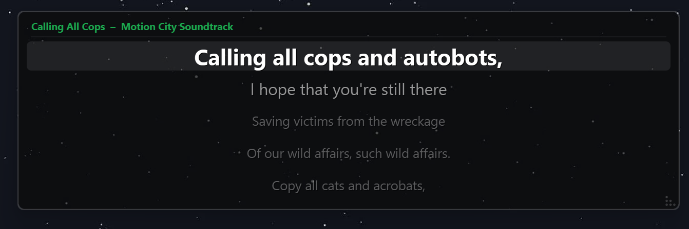

# Spotify MV Lyrics Overlay

A transparent, always-on-top lyrics overlay for Spotify on Windows. Displays time-synced lyrics over songs and music videos (or anything else on your screen) pulled automatically from the currently playing track.



---

## Features

- **Auto-detects** the currently playing Spotify track via the Web API
- **Time-synced lyrics** — lines advance in real time with the song
- **Graceful fallback** — uses plain lyrics (estimated scroll) when no synced version exists
- **Transparent overlay** — sits on top of Spotify's music video player
- **Draggable & resizable** — position and size it however you like
- **Right-click config menu** — adjust opacity, font size, font face, and context lines live
- **System tray icon** — click to show/hide, right-click to quit
- **Credentials stored securely** — API keys saved to a local file, never in source code
- No ads, no account required for lyrics ([lrclib.net](https://lrclib.net) is free and open)

---

## Requirements

- Windows 10 / 11
- Python 3.10+
- A free [Spotify Developer](https://developer.spotify.com/dashboard) app (takes ~2 minutes to set up)

---

## Setup

### 1. Install dependencies

```bash
pip install -r requirements.txt
```

### 2. Create a Spotify Developer app

1. Go to [developer.spotify.com/dashboard](https://developer.spotify.com/dashboard) and log in.
2. Click **Create App** — any name and description will do.
3. Under **Edit Settings → Redirect URIs**, add:
   ```
   http://127.0.0.1:8888/callback
   ```
4. Save, then copy your **Client ID** and **Client Secret**.

### 3. Run

```bash
python main.py
```

On first launch the overlay will prompt you to enter your credentials.
**Right-click the overlay → Spotify Credentials…** to open the setup dialog.

Once saved, a browser tab opens for Spotify OAuth login. After you approve it, the token is cached in `.spotify_cache` and future runs start silently.

> Credentials are stored in `.credentials.json` next to the script and are excluded from version control via `.gitignore`. You never need to edit a source file to configure the app.

---

## Usage

| Action | Result |
|---|---|
| Left-drag the overlay | Move it anywhere on screen |
| Drag the bottom-right corner | Resize the overlay |
| Right-click the overlay | Open the configuration menu |
| Right-click the overlay → Hide to Tray | Hide the overlay without quitting |
| Left-click the tray icon | Show or hide the overlay |
| Right-click the tray icon | Quit |

The overlay hides automatically when nothing is playing or no lyrics are found for the current track.

---

## Configuration

All settings are accessible via the **right-click menu** on the overlay — no file editing required.

| Menu | Options |
|---|---|
| **Spotify Credentials…** | Enter / update your Client ID and Client Secret |
| **Opacity** | 40% / 55% / 70% / 85% / 100% |
| **Font Size** | Small (16px) / Medium (20px) / Large (24px) / X-Large (30px) |
| **Font** | Segoe UI / Arial / Calibri / Georgia / Consolas |
| **Context Lines** | 1 / 2 / 3 / 4 lines shown above and below the current line |
| **Reset Position** | Snap overlay back to bottom-center of screen |

Default values for window size and polling interval can be changed in `config.py`:

| Setting | Default | Description |
|---|---|---|
| `POLL_INTERVAL_MS` | `1000` | How often Spotify is queried (ms) |
| `OVERLAY_WIDTH` | `860` | Initial overlay width (px) |
| `OVERLAY_HEIGHT` | `260` | Initial overlay height (px) |

---

## Project Structure

```
SpotifyMVLyrics/
├── main.py              # Entry point — wires everything together
├── config.py            # Window size and polling defaults
├── credentials.py       # Reads/writes .credentials.json
├── controller.py        # Orchestrates polling, fetching, and sync timing
├── spotify_poller.py    # QThread — polls Spotify Web API every second
├── lyrics_fetcher.py    # QThread — fetches synced lyrics from lrclib.net
├── lrc_parser.py        # Parses LRC [mm:ss.xx] format into timestamped lines
├── overlay.py           # PyQt6 transparent overlay widget + config menu
├── .credentials.json    # Your API keys (git-ignored, created on first save)
├── .spotify_cache       # OAuth token cache (git-ignored, created on first login)
└── requirements.txt
```

---

## How It Works

1. **`SpotifyPoller`** runs on a background thread, calling the Spotify Web API every second. When the track changes it emits `track_changed`; on every tick it emits `position_updated` with the current playback position.

2. **`AppController`** receives these signals and spawns a **`LyricsFetcher`** thread whenever the track changes. The fetcher queries [lrclib.net](https://lrclib.net) for synced LRC lyrics, falling back to plain text if none exist.

3. A **200 ms `QTimer`** drives lyric sync — it interpolates the playback position between API polls and maps it to the correct lyric line using binary search. For plain (un-timed) lyrics it estimates the line from the playback percentage.

4. **`LyricsOverlay`** receives the current line index and the surrounding context, then renders them with a custom `paintEvent`: the active line gets a highlight bar and full brightness; surrounding lines are progressively dimmed.

5. **Credentials** are read from `.credentials.json` at startup and whenever the poller is restarted. Saving new credentials via the dialog automatically restarts the poller and clears the OAuth cache so a fresh login flow begins.

---

## Lyrics Source

Lyrics are fetched from [lrclib.net](https://lrclib.net) — a free, open, community-maintained database of LRC-format synced lyrics. No API key is required. If a synced version isn't available, plain lyrics are used with position estimated from song progress.

---

## Troubleshooting

**Overlay shows "No Spotify credentials set"**
- Right-click the overlay and choose **Spotify Credentials…** to enter your Client ID and Client Secret.

**Overlay doesn't appear after setup**
- Make sure Spotify is open and a track is actively playing (not paused at launch).
- Check the system tray — left-click the green dot to show the overlay.

**"Auth error" message**
- Right-click → **Spotify Credentials…** and re-enter your credentials to trigger a fresh login.
- Alternatively, delete `.spotify_cache` manually and restart.

**"No lyrics found"**
- The track isn't in lrclib.net's database. The overlay hides itself in this case.
- Instrumental tracks are intentionally skipped.

**Lyrics are out of sync**
- Spotify's API can have up to ~1 s of latency. The app interpolates between polls to compensate, but a very slow network connection can increase drift.
